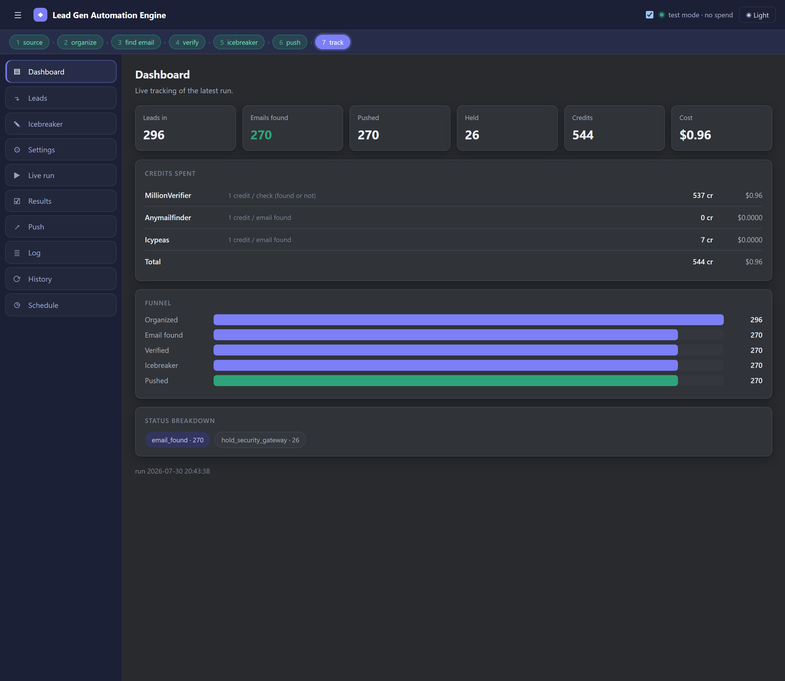
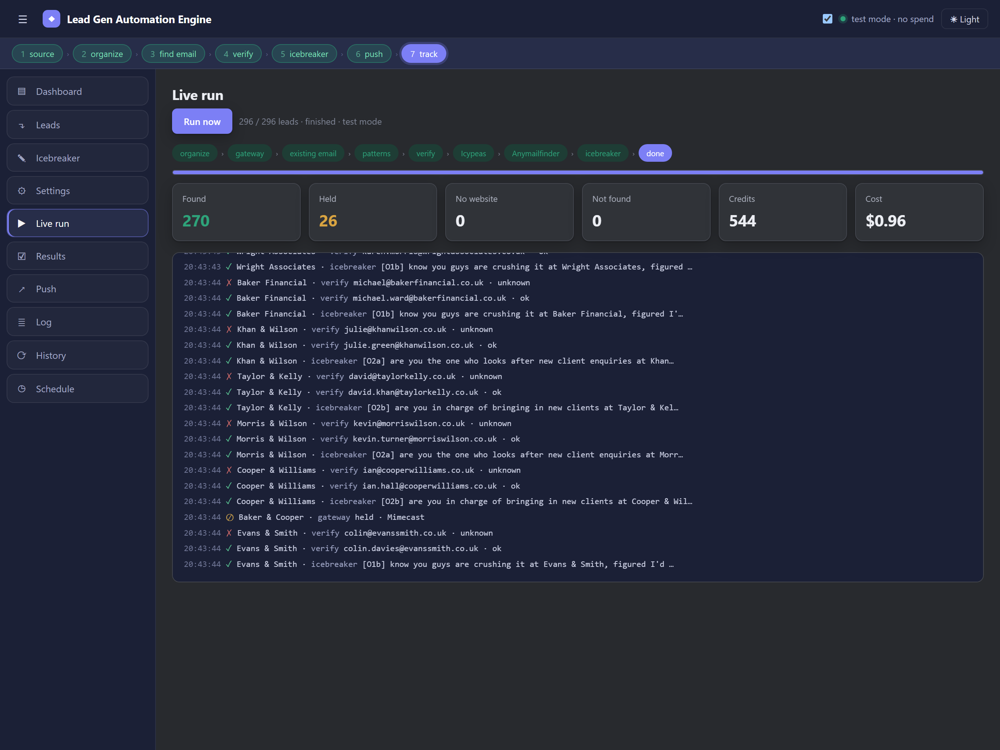
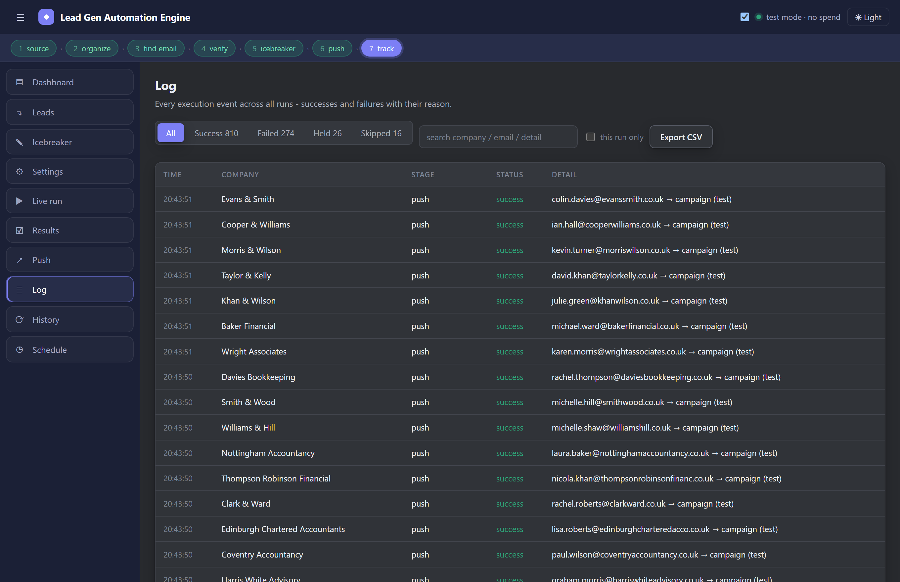
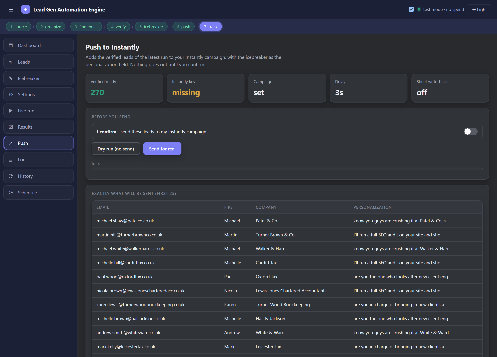
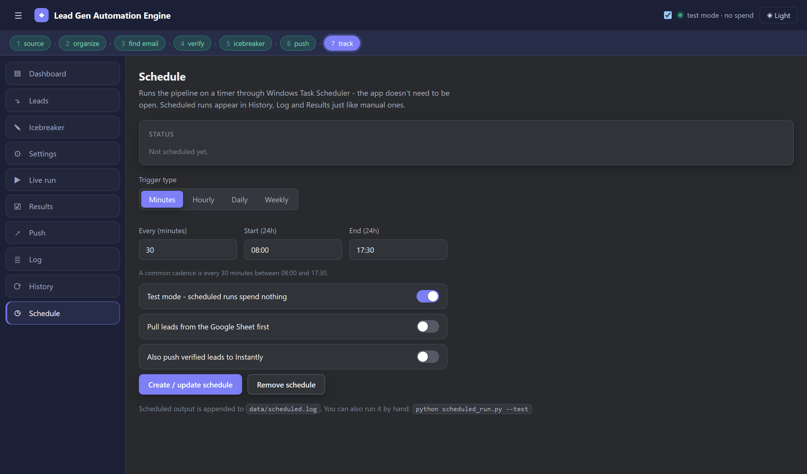
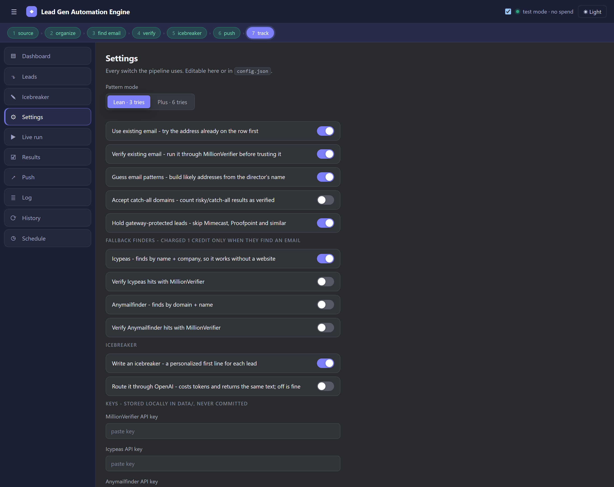

# Lead Gen Automation Engine

I run cold email campaigns for UK accountancy firms. This is the pipeline that feeds them.

The logic here isn't new. I built it first as an n8n workflow and ran it in production for months, tuning it against real lists until the hit rate and the cost per lead were where I wanted them. It worked, but n8n got in my way:

- I couldn't see inside a run. If something looked wrong I had to open the execution log and click through node by node.
- Every change meant editing a node in a browser. Testing a change meant burning real API credits, because there was no dry run.
- One flaky API response would kill a lead silently and I'd only notice later when the numbers didn't add up.

So I rebuilt it as a local app. Same steps, same order, same rules, but now I can watch it work and I can change it without spending anything to find out if I broke it.



## What it does

Give it a list of firms. It gives you back verified decision maker emails with a personalised opening line, pushed into an Instantly campaign, with every row's status written back to your sheet.

The run below is 296 firms: 270 emails found, 26 held back, 544 verification credits, 96 cents.

```
source  ->  organize  ->  find email  ->  verify  ->  icebreaker  ->  push  ->  track
```

**1. Source.** CSV upload, or read straight from a Google Sheet. Reading a sheet needs no credentials at all if it's shared by link.

**2. Organize.** Merges every file, dedupes by company, and picks one decision maker per firm. Seniority first (Owner beats Partner beats Director), oldest person wins a tie. This one rule made a real difference to reply rates, because you end up talking to whoever actually signs things off.

**3. Find the email.** Four sources, tried in order, stopping the moment one verifies:

- the address already on the row, if there is one and it isn't a generic `info@` mailbox
- pattern guessing from the director's name (`first.last@`, `f.last@`, and so on)
- Icypeas, which searches by name and company so it still works when a firm has no website
- Anymailfinder

Before any of that it checks the firm's mail gateway. Mimecast and Proofpoint bounce cold email hard enough that chasing those leads is money down the drain, so they get held. Cisco and Sophos are fine and go through.

**4. Verify.** MillionVerifier, one check per candidate, stopping at the first pass. Catch-all domains are rejected by default so "verified" actually means deliverable. You can loosen that if you want volume.

**5. Icebreaker.** A personalised first line per lead. There are three modes: a plain offer, a version that names a specific problem found on their site, and one for firms whose site is already good. I can edit all of that copy in the app now, which is the bit I use most.

**6. Push and track.** Adds the lead to an Instantly campaign with the icebreaker as the personalisation field, then writes the status back to the sheet row by row as it goes.



## The part I care about most: watching it run

This is the reason I rebuilt it. Every lead streams through the console as it's processed, with the stage it's in, what was tried, and what came back. When a run looks off I can see why in about two seconds instead of digging through execution logs.

The Log tab keeps every event across every run, filterable by success, failed, held or skipped, so I can go back and answer "what happened to this firm" weeks later.



## Not spending money by accident

Cold email tooling bills per API call and it adds up fast, so most of the design went into not wasting credits.

**Test mode.** Everything runs end to end with no API calls at all. I use it constantly to check a config change before it costs anything. The addresses it produces are generated from the name pattern and never checked, so the app labels them clearly and stamps `SIMULATED` on the export. That warning exists because I nearly imported a test file into a live campaign once, and that would have been a few hundred hard bounces.

**Credits are tracked per tool, with the right rule for each.** MillionVerifier charges per check whether it finds anything or not. Icypeas and Anymailfinder only charge when they actually return an email. The dashboard shows each separately, because a run that looks cheap on one can be expensive on another.

**It never redoes a lead.** Anything that reaches a final state gets recorded, so the next run picks up where the last one stopped. Run 50 leads today out of 500 and tomorrow it starts at 51. Without this, a schedule running every half hour would reverify the same leads twenty times a day.

**Retries.** Every API call retries three times with a backoff, and it retries a timeout or a 429 but not a 401. A bad key should fail immediately, not three times slowly.



## Sending is always deliberate

The push is the only thing that leaves my machine, so it's gated. It refuses to run without an explicit confirmation, it refuses a live send unless both the API key and campaign id are set, and the Push tab shows the exact payload for every lead before anything goes out. There's a dry run that exercises the whole path and sends nothing.

## Running it

```
start-app.bat
```

That's it. Opens on `http://127.0.0.1:8771`. First launch installs fastapi, uvicorn and python-multipart if they're missing.

To try it without any keys: leave test mode on, drop the CSVs from `samples/` on the Leads tab, then hit Run. The whole pipeline works offline.

For real runs you need a MillionVerifier key at minimum. Icypeas, Anymailfinder, OpenAI and Instantly are all optional and the pipeline just skips whatever you haven't configured.

## Scheduling

It runs on a Windows scheduled task: every N minutes, hourly, daily, or on chosen weekdays. The scheduled runner works headless, so the app doesn't need to be open. Whatever it does while you're away shows up in History and the Log afterwards.



## Settings

Everything is a switch, either in the UI or in `config.json`. Pattern mode, which finders to use, whether to trust catch-all domains, which gateways to hold, retry counts, per tool rates, the daily cap, sheet write-back.



## Tests

```
run-tests.bat
```

90 checks across 13 files. All of them run offline with no keys and no cost, because the whole point is being able to verify a change without paying for it. They cover the parts where a bug is expensive: director ranking, the email pattern order, the verification tiers, the gateway list, credit accounting, the retry logic, and the full cascade.

## What's in here

```
core/         the engine. organize, emailgen, verify, gateway, finders,
              icebreaker, instantly, sheets, ledger, retry, pipeline
webapp/       FastAPI server and the UI. no build step, no framework
samples/      example CSVs so you can run it immediately
eval_*.py     the tests, one file per module
scheduled_run.py   headless runner for the scheduled task
config.json   defaults
```

Every module in `core/` is pure logic with the network injected, which is why the tests can cover all of it without touching an API.

## Notes

- Keys and lead data live in `data/`, which is gitignored. Nothing sensitive is in this repo.
- Sheet write-back needs a Google service account. Reading doesn't, if the sheet is link-shared.
- The default cap is 50 leads a run. That's deliberate, it keeps sending volume sane.
- Screenshots are a test mode run against generated sample data, not real client records.
